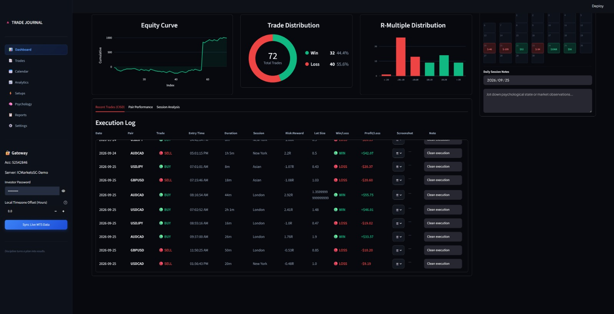

# ⚡ Trade Journal — Personal Trading Analytics App

A self-built desktop trading journal built with **Python + Streamlit**. Log your trades, upload trade screenshots, grade your setups, and analyze your performance — all from a sleek local web dashboard.

> Built for traders who want full control over their data without relying on paid tools.

---

## 📸 Preview



---

## 🚀 Features

| Feature | Description |
|---|---|
| 📋 **Trade Log** | Add, view, and manage all your trades in one place |
| 📸 **Screenshot Gallery** | Upload trade screenshots — saved permanently, organized by date |
| 🏷️ **Tier Grading** | Grade each trade (S, A+, A, B, C) to review trade quality |
| 📂 **Categories** | Organize trades with custom categories you define yourself |
| 📊 **Analytics Dashboard** | Visual charts: pair performance, session analysis, tier breakdown |
| 🔗 **MetaTrader 5 (Optional)** | Can auto-import trades if MT5 is installed |

---

## 🛠️ Tech Stack

| Tool | Role |
|---|---|
| **Python 3.10+** | Core programming language |
| **Streamlit** | Web UI framework (runs locally in your browser) |
| **SQLite** | Local database — stores all your trade data as a `.db` file |
| **Pandas** | Data processing and table management |
| **Plotly** | Interactive charts and visualizations |
| **Pillow (PIL)** | Image handling for trade screenshots |

> No server needed. No cloud. Everything runs on your own machine.

---

## 📁 Project Structure

```
Trading_Journal/
├── Trading_journal.py     ← Main application (the entire app lives here)
├── screenshots/           ← Your uploaded trade screenshots (auto-created)
├── .gitignore             ← Keeps personal data off GitHub
├── requirements.txt       ← Python dependencies
└── README.md              ← This file
```

---

## ⚙️ How to Run (Step by Step)

### 1. Make sure Python is installed

Check by opening your terminal and running:
```bash
python --version
```
You need **Python 3.10 or higher**. Download from [python.org](https://python.org) if needed.

---

### 2. Clone this repository

```bash
git clone https://github.com/YOUR-USERNAME/Trading_Journal.git
cd Trading_Journal
```

---

### 3. Create a virtual environment

A virtual environment keeps this project's dependencies separate from other Python projects.

```bash
# Create it
python -m venv .venv

# Activate it — Mac/Linux:
source .venv/bin/activate

# Activate it — Windows:
.venv\Scripts\activate
```

You'll know it worked when you see `(.venv)` at the start of your terminal line.

---

### 4. Install dependencies

```bash
pip install -r requirements.txt
```

---

### 5. Run the app

```bash
python -m streamlit run Trading_journal.py
```

The app will open automatically in your browser at:
```
http://localhost:8501
```

To stop the app, press `Ctrl + C` in the terminal.

---

## 📦 Generate requirements.txt

If you don't have a `requirements.txt` yet, run this inside your activated virtual environment:

```bash
pip freeze > requirements.txt
```

---

## 🔒 Data Privacy

- All your trade data is stored **locally** in a `.db` file on your machine
- Screenshots are stored in the local `screenshots/` folder
- **Neither the database nor screenshots are pushed to GitHub** (protected by `.gitignore`)

---

## 📌 Notes

- **MetaTrader 5 (MT5)** integration is optional. The app runs fine without it.
- The `screenshots/` folder is created automatically when you first upload an image.
- This app is designed for **local use only** — it is not deployed online.

---

## 👤 Author

Made by **[Your Name]** — a trader building tools to improve discipline and consistency.

- GitHub: [@your-username](https://github.com/your-username)

---

## 📄 License

This project is open source under the [MIT License](LICENSE).
